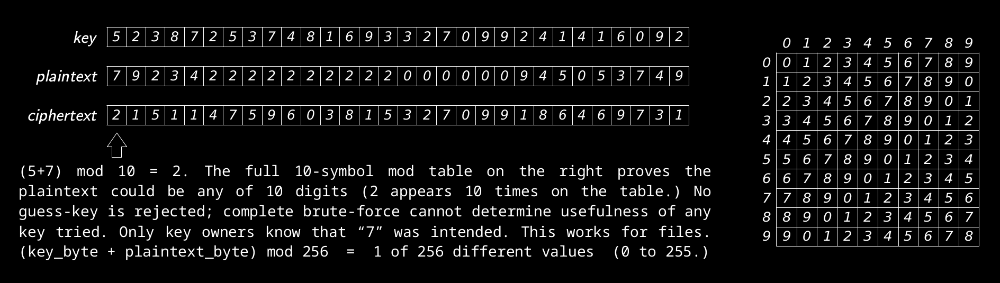
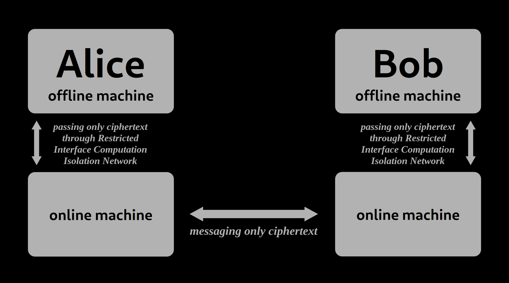

### Run it

```apt install g++ geany```. Open the .cpp in Geany. Hit F9 once. F5 to run.

<br>

### Terminal

```text
(1) Get keys
(2) Encrypt outgoing file
(3) Decrypt received file

Option: |
```

<br>

### How it works

```text
      you make 5 keys:     1       2       3       4       5
   user 2 gets copies:     1       2       3       4       5
   user 3 gets copies:     1       2       3       4       5
   user 4 gets copies:     1       2       3       4       5
   user 5 gets copies:     1       2       3       4       5


                           ^                               ^
                      with which                      with which
                   you encrypt, and                user 5 encrypts,
                    others decrypt                and others decrypt


Send in the order encrypted, and decrypt in the order received! Keys are files
that contain a rolling-seed, which is used to generate pseudorandom bytes 0-255.
```

<br>

### Perfect secrecy proof

<p align="center">
  
</p>

<sup>Original discoverer of the One-time pad (perfect secrecy) is not mentioned as I had independently rediscovered it ~December 2019</sup>

<br>

### Security

* Uses my https://github.com/compromise-evident/rolling-code

<br>

### Recommended setup for chatting securely

<p align="center">
  
</p>
